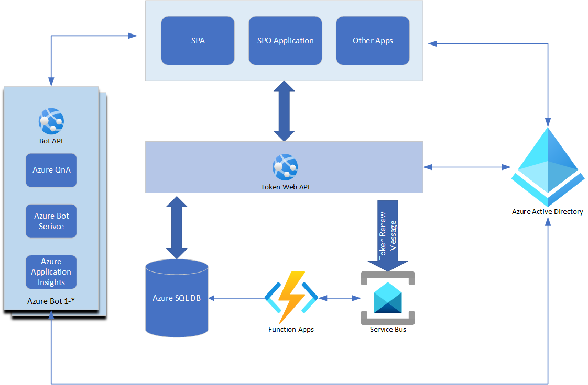

# WebBotSolution

This sample demonstrated the QnA bot 

## Diagram

## Overview
- [BotAPI](./WebBotAPI-DotNet/BotAPI/README.md): the Web API to generate the bot token based on the user context
- [BotTokenRenewFunction](./WebBotAPI-DotNet/BotTokenRenewFunction/README.md): a Azure Function to renew the user's token
- [QnABot](./WebBotAPI-DotNet/QnAMaker/README.md): a QnA Bot
- [SPFx](./SPFx/README.md): a QnA Bot
- TestConsoleApp: test console application
